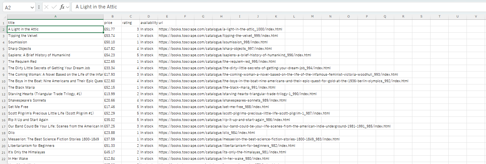

# bookscraper

書籍サイト [Books to Scrape](https://books.toscrape.com)(スクレイピング練習用の公開デモサイト)から、全書籍の情報を収集してCSVファイルに出力するツールです。

## 実行結果のイメージ



全50ページ・約1,000冊分の「書名・価格・星評価・在庫状況・詳細ページURL」を約1分で収集し、Excelでそのまま開けるCSVとして保存します。

サンプル出力: [output/books.csv](output/books.csv)

## 環境構築

```powershell
# 仮想環境の作成と有効化(Windows / PowerShell)
python -m venv .venv
.\.venv\Scripts\Activate.ps1

# 必要ライブラリのインストール(初回のみ)
pip install -r requirements.txt
```

## 使い方

```powershell
# 全ページを取得
python scraper.py

# ページ数や出力先を指定する場合
python scraper.py --pages 3 --output output/test.csv
```

## 工夫した点

- **サーバーへの配慮**: リクエスト間隔を1秒空け、対象サイトに負荷をかけない設計にしています
- **リトライ処理**: 一時的な通信エラーが起きても最大3回まで自動で再試行し、失敗したページはスキップして処理を継続します
- **Excelでの文字化け防止**: CSVをBOM付きUTF-8(utf-8-sig)で出力し、Excelでダブルクリックするだけで正しく開けるようにしています
- **出力フォルダの自動作成**: 出力先のフォルダが存在しない場合は自動で作成します
- **進捗表示**: 処理中のページ番号を表示し、長時間の実行でも状況が分かるようにしています

## 動作環境

- Windows / Python 3.10以上
- requests / beautifulsoup4(requirements.txt参照)

## ファイル構成

```
bookscraper/
├── scraper.py        # スクレイピング本体
├── requirements.txt  # 必要ライブラリ
├── output/
│   └── books.csv     # 実行結果のサンプル
└── images/
    └── result.png    # 実行結果のスクリーンショット
```

## 注意事項

本ツールはスクレイピング学習用に公開されているデモサイトを対象としています。実在のWebサイトに対してスクレイピングを行う場合は、対象サイトの利用規約・robots.txtを確認し、適切なアクセス間隔を設ける必要があります。